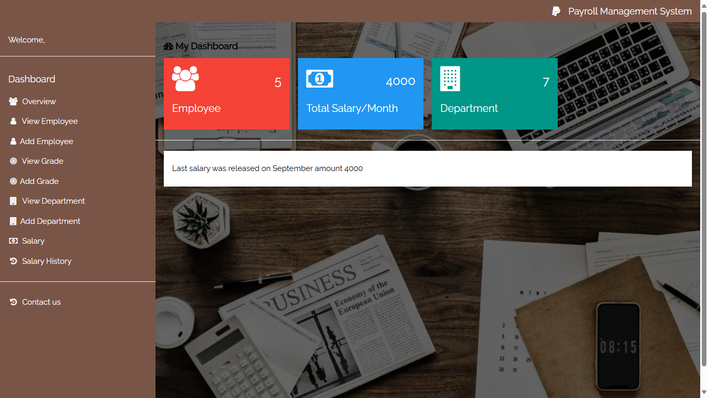

# Payroll Management System

Welcome to the Payroll Management System! This application is designed to help manage employee information, departments, grades, and salaries efficiently. The system allows you to view, add, and manage employees and their payment history in a user-friendly interface.

## Project Structure

The project is organized into the following directories and files:

```
├── css
│   └── main.css                # Main stylesheet for the application
├── data
│   └── payroll.sql             # SQL file for database schema and initial data
├── image
│   ├── dashboard.jpg           # Image used in the dashboard
│   └── pic1.jpg                # Another image used in the application
├── parts
│   ├── header.php              # Header part of the application
│   └── sidebar.php             # Sidebar navigation menu
├── php
│   ├── add-department.php      # Add new department
│   ├── add-employee.php        # Add new employee
│   ├── add-grade.php           # Add new grade
│   ├── add-salary.php          # Add new salary
│   ├── contact.php             # Contact page
│   ├── db.php                  # Database connection details
│   ├── index.php               # Main dashboard page
│   ├── login.php               # Login page
│   ├── release-salary.php      # Release salary
│   ├── remove-department.php   # Remove department
│   ├── remove-employee.php     # Remove employee
│   ├── remove-grade.php        # Remove grade
│   ├── salary-history.php      # View salary history
│   ├── salary.php              # Salary page
│   ├── view-department.php     # View department details
│   ├── view-employee-payment-history.php # View employee payment history
│   ├── view-employee.php       # View employee details
│   └── view-grade.php          # View grade details
└── README.md                   # This README file
```

## Prerequisites

To run this project, you will need the following:

- PHP 7.0 or higher
- MySQL or MariaDB
- A web server (e.g., Apache, Nginx, WAMP, XAMPP)

## Installation

1. **Clone the repository:**
   ```sh
   git clone https://github.com/ahzem/payroll-management-system.git
   cd payroll-management-system
   ```

2. **Import the database:**
   - Create a new database in MySQL.
   - Import the `payroll.sql` file into your database.
   - Update the database connection details in `db.php`.

3. **Set up the web server:**
   - Ensure your web server is running.
   - Place the project files in the web server's root directory (e.g., `C:/wamp64/www/Payroll Management` for WAMP).

4. **Run the application:**
   - Open your web browser and navigate to `http://localhost/Payroll Management`.

## Usage

### Dashboard

- The dashboard provides an overview of the total number of employees, total salary per month, and the number of departments.

### Employee Management

- **View Employees:** Navigate to "View Employee" to see a list of all employees.
- **Add Employee:** Use the "Add Employee" page to add new employees to the system.

### Department Management

- **View Departments:** Navigate to "View Department" to see a list of all departments.
- **Add Department:** Use the "Add Department" page to add new departments.

### Grade Management

- **View Grades:** Navigate to "View Grade" to see a list of all grades.
- **Add Grade:** Use the "Add Grade" page to add new grades.

### Salary Management

- **Salary:** Navigate to the "Salary" page to manage salaries.
- **Salary History:** View the history of salary releases on the "Salary History" page.

### Contact

- Use the "Contact us" page to get in touch with the administrators.

## Screenshots



## Contributing

If you'd like to contribute to this project, please fork the repository and create a pull request. Contributions are welcome!

## License

This project is licensed under the MIT License. See the `LICENSE` file for more details.

## Acknowledgements

- Icons by FontAwesome
- CSS framework by W3.CSS